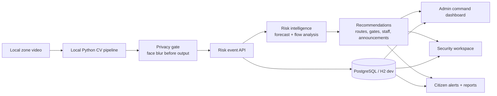
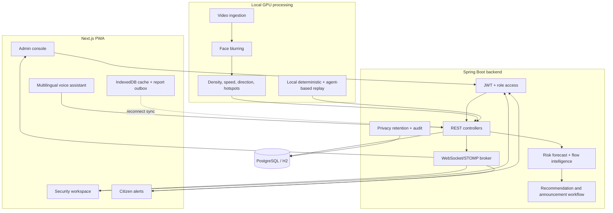
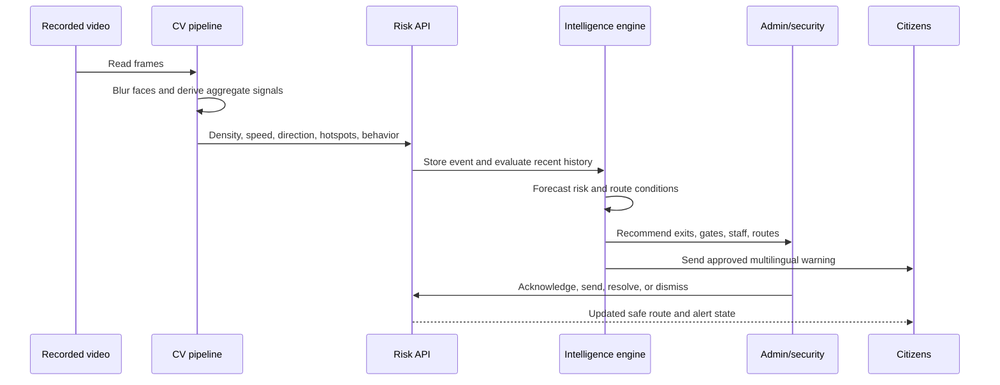
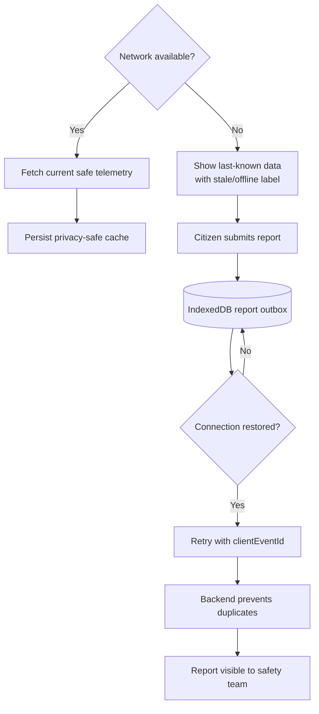
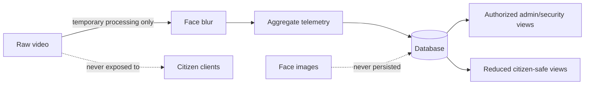

# Nirikshan Backend

Spring Boot 3.3 / Java 17 event-serving backend for the Nirikshan crowd-risk prototype. The local Python CV pipeline supplies privacy-safe density, movement, risk level, and explanation values; this service stores, analyzes, broadcasts, and serves them.

## Product overview

Nirikshan is a privacy-aware crowd-safety platform for campus and venue operations. A local GPU machine extracts aggregate movement signals from configured footage, then the backend predicts rising risk, recommends safer interventions, and distributes role-appropriate alerts to administrators, security staff, and citizens.

> **Intentional hackathon architecture:** CV processing runs locally on a GPU-accelerated development machine. Six independent local workers process the configured zones—one YOLO process per zone—and POST privacy-safe risk events to the selected backend. The deployed Render backend does not run YOLO, SAHI, or Python video processing. It only receives, persists, analyzes, and serves the resulting event data.

```text
Local RTX 4050: six zone-specific YOLO workers
        ↓ POST /api/risk-events
Render: Spring Boot + PostgreSQL + REST + WebSocket + frontend data delivery
```



### Architecture at a glance



### Operational safety loop



### Offline behavior



Offline mode deliberately caches only aggregate safety information and approved announcements. It never stores raw video, frames, face data, credentials, or administrator actions. A fully disconnected device cannot receive a new live alert without a network or separate broadcast channel.

### Role and data boundaries

| Role | Can view | Can do |
|---|---|---|
| Administrator | All zones, forecasts, recommendations, reports, audit state | Review event telemetry, approve announcements, coordinate responses |
| Security operator | Assigned-zone alerts, routes, interventions, reports | Acknowledge alerts and follow or execute staff instructions |
| Citizen | Safe venue messages, localized alerts, routes, aggregate map context | Submit incident reports and receive safety guidance |

### Core data boundary



## Authentication roles

The public mobile experience at `/alerts` creates `CITIZEN` accounts only. Security accounts are created by an administrator and must change their one-time password at first sign-in. The unlinked administrator console is `/console`, with login at `/console/login`.

Before starting the backend for the first time, seed a demo admin using environment variables:

```powershell
$env:ADMIN_SEED_EMAIL="admin@example.com"
$env:ADMIN_SEED_PASSWORD="ChangeThisPassword123!"
$env:NIRIKSHAN_JWT_SECRET="use-a-long-random-secret-of-at-least-32-characters"
```

The hidden route is suitable only for a hackathon demo. A production deployment also needs network-level administrative access restrictions.

## Run locally

Requirements: Java 17+, Maven 3.9+, Python 3.10+, and an NVIDIA CUDA-capable environment for the six local workers.

Create the local CV environment from `cv-pipeline/` on Windows PowerShell:

```powershell
python -m venv venv
.\venv\Scripts\Activate.ps1
python -m pip install --upgrade pip
pip install torch torchvision --index-url https://download.pytorch.org/whl/cu121
pip install -r requirements.txt
```

Direct CV commands should be run after activating this venv. The Spring Boot backend does not resolve or launch this interpreter.

The local runner requires CUDA by default. If CUDA is unavailable, it stops the affected zone process with an explicit error instead of silently moving inference to the backend. Use `--allow-cpu` only for deliberate local diagnostics.

### Render deployment: event-only backend

The root `Dockerfile` builds and runs only the Java application. The Render image does not install Python, PyTorch, OpenCV, FFmpeg, YOLO weights, or a CV worker. `render.yaml` sets `SPRING_PROFILES_ACTIVE=prod` and `NIRIKSHAN_CV_BACKEND_PROCESSING_ENABLED=false`.

In Render, create a **Blueprint** from this repository and review the prompted secret values before applying it. The Blueprint creates the backend in Singapore and uses `/api/health` as its health check. It is configured for Render's free web-service plan for an initial test, so it does not attach a persistent disk. Set `DATABASE_URL` to the existing PostgreSQL connection string if migrating the current database; the Blueprint intentionally does not create or replace a database. Set `NIRIKSHAN_ALLOWED_ORIGINS` to the deployed frontend URL, and add `GROQ_API_KEY` if AI summaries are enabled. Render supports the Dockerfile directly and uses the service's injected `PORT` automatically.

Render receives `POST /api/risk-events`, persists telemetry to PostgreSQL, runs backend intelligence/recommendations, and serves REST/WebSocket updates. Video uploads, per-zone workers, shared workers, scenario subprocesses, and automatic Python reconciliation are rejected/disabled in the backend.

This is an intentional hackathon split: the local GPU machine owns video ingestion and YOLO/SAHI inference; Render owns the Spring Boot API, PostgreSQL, REST, WebSocket, and frontend data delivery. A future production deployment should use a dedicated GPU-backed inference service, queue, or inference server separate from the web backend.

```text
mvn spring-boot:run
```

On Windows, the recommended launcher starts only Spring Boot:

```powershell
Set-ExecutionPolicy -Scope Process Bypass
.\run-backend.ps1
```

### Multilingual AI safety communications

Nirikshan's AI assistant and on-demand incident summaries support English (`en`), Hindi (`hi`), and Odia (`or`). Use the language selector in the assistant header or the page header. The selection is persisted in browser local storage and is sent with each AI request. Chat requests honor an explicit `language` value; when omitted, the backend detects Devanagari as Hindi, Odia script as Odia, and otherwise uses English. The LLM handles the generated-language response, so additional languages can be added by extending the supported language options rather than adding translation files.

Incident summaries use Groq's OpenAI-compatible chat API. Create a free key at [console.groq.com](https://console.groq.com) without adding a billing card. The Spring Boot backend reads `GROQ_API_KEY` from its own process environment through `${GROQ_API_KEY:}`. It does not read `frontend/.env.local`, and there is no backend `.env` file or `application.yml` dotenv loader configured for this key.

For local development in PowerShell, set the variable in the same shell that starts Spring Boot:

```powershell
$env:GROQ_API_KEY="gsk_your_key_here"
mvn spring-boot:run
```

If using `.\run-backend.ps1`, set `$env:GROQ_API_KEY` before running the script; it passes the existing backend environment through and never imports the frontend env file. For Render, add `GROQ_API_KEY` during Blueprint setup or in the backend service's **Environment** tab, then redeploy. Do not put this secret in `frontend/.env.local`; that file is only for browser-safe `NEXT_PUBLIC_*` settings.

At startup, the backend logs either `GROQ_API_KEY found` with a masked value or `GROQ_API_KEY missing`. AI responses return a localized unavailable message only when the key or API is unavailable.

The authenticated AI endpoints are:

- `POST /api/assistant/chat` — accepts `language` as optional `en`, `hi`, or `or`; omitted language is detected from the message script.
- `GET /api/zones/{zoneId}/incident-summary?language=en|hi|or` — detailed summary for one zone, subject to the caller's role scope.
- `GET /api/venue/incident-summary?language=en|hi|or` — concise campus-wide summary, subject to the caller's role scope.

### Database profiles

The default profile is `local-postgres`, which uses PostgreSQL with Flyway migrations and Hibernate schema validation. This keeps risk events, citizen reports, alerts, jobs, and users across backend restarts. The PostgreSQL JDBC driver and Flyway are included in `pom.xml`.

For a local PostgreSQL server:

```powershell
$env:SPRING_PROFILES_ACTIVE="local-postgres"
$env:DATABASE_URL="jdbc:postgresql://localhost:5432/nirikshan"
$env:DATABASE_USERNAME="postgres"
$env:DATABASE_PASSWORD="your-local-password"
mvn spring-boot:run
```

`DATABASE_URL` may also be a `postgresql://...` URL. The backend converts it to the JDBC form automatically. `SPRING_DATASOURCE_URL`, `SPRING_DATASOURCE_USERNAME`, and `SPRING_DATASOURCE_PASSWORD` override the `DATABASE_*` variables when present.

For Render deployment, keep the existing PostgreSQL database or create a Render PostgreSQL service separately, then set `DATABASE_URL` in the backend service. The production profile seeds the Campus 25 venue/zones and creates an administrator only when the explicit admin seed variables are present. Keep the real credential in Render variables, never in source control:

```text
SPRING_PROFILES_ACTIVE=prod
DATABASE_URL=postgresql://<user>:<password>@<render-postgres-host>:5432/<database>
NIRIKSHAN_JWT_SECRET=<long-random-secret>
ADMIN_SEED_EMAIL=<admin-email>
ADMIN_SEED_PASSWORD=<strong-admin-password>
ADMIN_SEED_FORCE_RESET=false
```

For first-time recovery of a live administrator account, temporarily set `ADMIN_SEED_EMAIL` to the intended administrator email, set a new `ADMIN_SEED_PASSWORD`, and set `ADMIN_SEED_FORCE_RESET=true` in the backend deployment environment. Redeploy once, confirm login at `/console/login`, then immediately set `ADMIN_SEED_FORCE_RESET=false` and redeploy again. Never commit these values to the repository. Browser location requires an HTTPS live URL and user permission; if location is denied, citizens can still search for **KIIT Campus 25** manually.

Render provides `DATABASE_URL` directly. The `prod` profile also supports `PGHOST`, `PGPORT`, `PGDATABASE`, `PGUSER`, and `PGPASSWORD` if you prefer separate variables. For local testing against a Render database, use its external connection URL rather than the private internal hostname:

```powershell
$env:SPRING_PROFILES_ACTIVE="prod"
$env:DATABASE_URL="postgresql://<user>:<password>@<render-postgres-host>:5432/<database>"
mvn spring-boot:run
```

On a fresh PostgreSQL database, Flyway applies `src/main/resources/db/migration/V1__create_initial_schema.sql` before Hibernate starts. Existing non-empty prototype databases are baselined at version `0`, then the idempotent migration runs; it can create missing tables such as `users` without deleting existing data. If the schema is incomplete in another way, startup fails with the exact validation error instead of silently serving a broken app. The seed runner is enabled for `dev`, `local-postgres`, and `prod`. It creates missing Campus 25 venue/zones in a fresh database, but it never overwrites an existing administrator unless `ADMIN_SEED_FORCE_RESET=true` is explicitly enabled.

The public health endpoint is `http://localhost:8080/api/health`. It reports the active profile, database name/schema, missing required tables, and row counts. A `DOWN` response means the backend is pointed at the wrong database, cannot connect, or has an incomplete schema.

To use the disposable offline H2 fallback:

```powershell
$env:SPRING_PROFILES_ACTIVE="dev"
mvn spring-boot:run
```

The H2 `dev` profile uses `create-drop`; data is intentionally lost when the process stops. H2 console: `http://localhost:8080/h2-console` with JDBC URL `jdbc:h2:mem:nirikshan`.

For a production admin, create the account in the connected PostgreSQL database. `pgcrypto` produces BCrypt-compatible `$2a$` hashes accepted by Spring Security:

```sql
CREATE EXTENSION IF NOT EXISTS pgcrypto;
UPDATE users
SET password_hash = crypt('replace-with-a-strong-password', gen_salt('bf', 12)),
    role = 'ADMIN', active = true, must_change_password = false
WHERE lower(email) = lower('admin@example.com');
```

Always run this against the same database shown by `/api/health`.

### Six independent local zone workers

Create `cv-pipeline/outputs/live/zones.json` with one entry per configured zone. Relative `input` paths are resolved from `cv-pipeline`:

```json
[
  {"zoneId": 1, "input": "real_footage/main_gate.mp4", "sourceClipId": "main-gate"},
  {"zoneId": 2, "input": "real_footage/hostel_gate.mp4", "sourceClipId": "hostel-gate"},
  {"zoneId": 3, "input": "real_footage/cafeteria.mp4", "sourceClipId": "cafeteria"},
  {"zoneId": 4, "input": "real_footage/a_block.mp4", "sourceClipId": "a-block"},
  {"zoneId": 5, "input": "real_footage/c_block.mp4", "sourceClipId": "c-block"},
  {"zoneId": 6, "input": "real_footage/c_block_exit.mp4", "sourceClipId": "c-block-exit"}
]
```

Start six concurrent local processes and send events to Render:

```powershell
python cv-pipeline/run_local_cv_workers.py `
  --manifest cv-pipeline/outputs/live/zones.json `
  --target-url https://<render-backend-url>/api/risk-events `
  --workers 6
```

The supervisor logs each zone PID, keeps one child per zone, stops a worker when its manifest entry is disabled or its source disappears, and does not automatically restart a failed worker. Each child runs the existing `process_video.py` loop, owns its own YOLO model, applies the existing privacy/detection/risk/event logic, and posts events containing its assigned `zoneId`. CUDA/VRAM/model failures are tagged with the affected zone and process ID; tune `--workers`, `--model`, thresholds, or inference settings after inspecting the error. There is no cloud fallback.

The web console intentionally has no upload or cloud-inference controls. It displays this architecture message; use the local runner for footage and the event APIs for stored results.

### Legacy video-processing endpoints

The old multipart upload, `ZoneFeed`, and processing-job routes remain wired only for compatibility with stored records, but backend CV execution is disabled. They reject new processing requests rather than starting Python. This keeps Render and local Spring Boot event-only and prevents a duplicate worker topology.

### Privacy architecture and retention

Every camera frame passes through the local OpenCV Haar face detector in `cv-pipeline/privacy.py` before person detection, annotation, WebSocket/live processing, or any output write. Face regions are Gaussian-blurred in memory. A detector, frame, or privacy pipeline error raises `PRIVACY_PROCESSING_FAILED`; the backend marks the job/feed failed and blocks the footage instead of exposing an unsanitized frame. Raw `/feed-files/**` access is disabled, so active live feeds expose metrics only; completed job video artifacts are sanitized annotations and require an authenticated administrator or security account.

Privacy retention is configured with `NIRIKSHAN_RAW_VIDEO_RETENTION_HOURS` (default `0` after one-off processing), `NIRIKSHAN_PROCESSED_FRAME_RETENTION_HOURS` (default `24`), `NIRIKSHAN_AGGREGATE_EVENT_RETENTION_DAYS` (default `365`), and `NIRIKSHAN_PRIVACY_CLEANUP_INTERVAL_MS` (default one hour). Temporary one-off uploads are deleted in the processing runner; active loop-feed sources remain private only while coverage is running and are deleted when coverage stops. Cleanup removes expired annotated video and old aggregate events while preserving only privacy-safe telemetry such as density, people count, speed, risk, zone, timestamp, and direction.

For a local privacy smoke check against a sample clip, run `python cv-pipeline/smoke_privacy.py --input sample.mp4 --output sanitized-smoke.mp4`. The command fails if the local OpenCV face detector is unavailable or any frame cannot be sanitized.

Uploads, processing start/completion/failure, sanitized footage access, and deletions are recorded in `privacy_audit_events`. Audit details never include frames, face images, raw video, tokens, passwords, or other sensitive payloads. The public **Privacy & Data Handling** page is available at `/privacy`.

### Offline synchronization

The PWA stores only privacy-safe read data in browser IndexedDB: venue/zone coordinates, aggregate risk telemetry, routes, alerts, forecasts, and approved announcements. Raw video, frames, face data, credentials, and administrator actions are never cached. Citizen incident reports submitted without connectivity are stored in a local outbox with a client event ID and automatically retried when the browser returns online. The backend treats that ID as idempotent, so reconnect retries cannot create duplicate reports. Offline screens clearly state that cached data may be stale; a disconnected device cannot receive a brand-new live alert without a network or separate broadcast channel.

The backend does not require a Python runtime or YOLO weights. The local runner resolves the active Python interpreter from the shell/venv that launches it. `NIRIKSHAN_REQUIRE_CUDA=1` is set automatically for local workers unless `--allow-cpu` is supplied.

The event API accepts only privacy-safe aggregate telemetry. Raw footage remains on the local GPU machine and is never uploaded to Render by the Nirikshan CV workflow.

To build:

```text
mvn clean package
```

Swagger UI is available at `http://localhost:8080/swagger-ui.html`; OpenAPI JSON is at `/v3/api-docs`.

## API

Processing jobs:

- `POST /api/jobs/upload?zoneId={id}` — upload a campus video as multipart field `file`; immediately returns a pending job.
- `GET /api/jobs/{id}` — processing status and result links.
- `GET /api/jobs?zoneId={id}` — job history for a zone; omit `zoneId` for all jobs.

- `POST /api/risk-events` — ingest a CV-generated event; updates its zone and creates an alert for HIGH or CRITICAL.
- `GET /api/venues` — list venues.
- `GET /api/venues/{id}/zones` — list zones for a venue.
- `GET /api/zones/{zoneId}/risk-events?limit=50` — recent events for a zone (limit capped at 200).
- `GET /api/alerts?active=true` — unresolved alerts; omit `active` for all alerts.
- `PATCH /api/alerts/{id}/resolve` — resolve an alert.

STOMP clients connect to `/ws`. Free in-app notifications are delivered through WebSocket topics: live risk/congestion events use `/topic/risk-updates`, citizen incident alerts use `/topic/alerts`, admin/security recommendations use `/topic/recommendations`, and approved multilingual announcement drafts are delivered to citizens on `/topic/citizen-announcements`. Evacuation route guidance is available through the in-app route endpoints and is never sent through an external notification service.

### Deterministic safety loop

Each ingested event stores current density, density change from the previous reading, movement speed and slowdown, hotspot regions, hotspot persistence, bottleneck state, risk level, and a human-readable explanation. The backend does not require AI for detection or action selection.

Recommendations use these exact local rules after at least 3 readings spanning 20 seconds: 65% MEDIUM+ readings, 40% HIGH+ readings, or a rising density delta of at least 0.35 with at least half the readings rising. A persistent hotspot plus slowdown selects `CLOSE_ENTRY`; rising density selects `REDIRECT`; HIGH risk plus slowdown selects `DEPLOY_SECURITY`; HIGH risk with no active security assignment selects `REASSIGN_PERSONNEL`; otherwise sustained MEDIUM selects `OPEN_ROUTE`. Two or more sustained high-risk zones create a venue-wide `ANNOUNCEMENT`. Pending recommendations are deduplicated by type and zone, have a two-minute cooldown, and are dismissed and broadcast when three or more low-risk readings span 20 seconds. Low-risk recovery also resolves recent active alerts.

For a camera-free live deployed demo, generate and replay locally into Render:

```powershell
python cv-pipeline/replay_events.py `
  --events cv-pipeline/outputs/demo-persistent.json `
  --target-url https://<render-backend-url>/api/risk-events `
  --speed 20
```

Generate that fixture locally first with `python cv-pipeline/replay_scenarios.py persistent --zone-id 1 --output cv-pipeline/outputs/demo-persistent.json`. `replay_events.py` prefers `--target-url`; the existing `--url` flag remains supported for compatibility. Use `http://localhost:8080/api/risk-events` as the target for a local backend.

Available fixtures are `normal`, `buildup`, `surge`, `persistent`, and `recovery`; every event is labelled `DEMO REPLAY` and uses a `DEMO_REPLAY_*` source id.

### Local Scenario Simulator

Scenario generation and replay also happen locally. The backend never launches the generator or replay scripts, including in `prod`:

```powershell
python cv-pipeline/replay_scenarios.py persistent `
  --zone-id 1 `
  --output cv-pipeline/outputs/demo-persistent.json `
  --target-url https://<render-backend-url>/api/risk-events `
  --speed 20
```

The `/admin/scenarios` page explains this and disables controls that would imply a backend subprocess. Scenario events still carry `source: "SIMULATION"`, so the existing dashboard, alerts, recommendations, forecasts, and reports continue to label and process them normally.

Scenario events carry `source: "SIMULATION"`; camera-derived events carry `source: "LIVE"`. While a run is active, the affected zone shows a dashed purple `SIMULATION MODE` treatment on the map and dashboard. Alerts, recommendations, trend data, and hotspot details remain in the same operational loop but are visibly simulation-backed. Completion or cancellation restores the latest live event, or resets the zone to an offline/low-telemetry state when no live feed exists. Security and citizen roles cannot access the simulator because its endpoints and page are administrator-only.

The local scenario runner lets administrators run deterministic test scenarios (buildup, surge, hotspot, recovery) to validate system responses and train staff on procedures — distinct from live camera-derived data, clearly labeled when active.

### Predictive early warning

Forecast analysis uses a fixed window of at least 5 valid readings spanning 30 seconds. Repeated requests with the same latest telemetry identity return the same analytical result; only freshness metadata changes between requests. State transitions use a 20-second hysteresis window, and confidence is rounded to whole percentages with a two-point display deadband.

The backend exposes `GET /api/zones/{zoneId}/risk-forecast` for administrators and assigned security staff. It uses the latest 50 valid LIVE/SIMULATION readings, ignores duplicate timestamps, EWMA smoothing (`alpha=0.4`), and a bounded least-squares density slope capped at `0.02 people/m²/second`. A forecast requires at least 5 valid readings spanning 30 seconds and becomes stale/`INSUFFICIENT_DATA` when telemetry is older than 30 seconds. It projects density at 1, 3, 5, and 10 minutes against the shared density thresholds of 1.5 (MEDIUM), 4.0 (HIGH), and 6.0 (CRITICAL) people/m². Confidence is calculated from stable data-quality, fit, recency-bucket, and signal-agreement inputs, rounded to whole percentages, and held within a two-point display deadband.

The forecast response includes current and projected risk, density and movement trends, hotspot persistence, bottleneck state, estimated seconds to the next threshold, confidence, explanation, source, stale state, and all four projection points. Forecast updates are also broadcast on `/topic/risk-forecasts`. Citizen accounts receive only the safe venue-level message endpoint `GET /api/venue/risk-forecast?venueId={id}`; raw confidence, projections, and operational details are not exposed there.

The simulator also supports `Slowdown With Rising Density`, which demonstrates `STABLE` → `RISING` → `SURGE_RISK`/`CRUSH_RISK` → `RECOVERING` as the deterministic replay progresses. All forecast-triggered recommendations explicitly say they are based on projected risk, not a confirmed current incident.

The previous backend-driven `smoke_scenario_api.py` flow is no longer a supported way to launch replay because the Scenario Controller is intentionally event-only. Use the local replay command above, then verify the normal risk-event/recommendation/alert APIs and forecast endpoint from the dashboard.

### Manual end-to-end safety drill

1. Start the backend with `.\run-backend.ps1`, start the frontend with `npm run dev` from `frontend/`, and sign in at `http://localhost:3000/console` as an administrator.
2. From a local CV terminal, run the scenario generation/replay command above against localhost or Render.
3. Return to **Dashboard**. Confirm the affected zone shows **SIMULATION MODE**, the map/zone card receives new density events, the trend rises, and hotspot/bottleneck details appear when enough persistent readings have arrived.
4. Open **Administration**. Confirm the response action shows the simulation badge, a plain-language reason, and one current action for the zone rather than a growing duplicate list. Select **Take Action** and verify the instruction form is pre-filled on the separate **Send instructions** page for the same zone and source item.
5. Send the instruction. Confirm the recommendation or alert is acknowledged/resolved, then open the security workspace and verify the security operator receives the instruction or alert. On `/alerts`, confirm any `OPEN_ROUTE` guidance is labelled **SIMULATION** and is visibly distinct from live data.
6. Run a locally generated **Recovery** fixture for the same zone. Confirm the risk trend returns to LOW, stale alerts and recommendations disappear from the admin and citizen views, and the zone returns to its latest LIVE telemetry or explicitly shows offline/no live telemetry.
7. Repeat with **Sudden Surge** and **Persistent Hotspot**. The surge should create a sharp density/risk jump; the persistent hotspot should keep the same hotspot region active long enough to show bottleneck state and prefer `CLOSE_ENTRY`. Stop a run mid-way once to verify cleanup/restoration also happens on cancellation.

If browser automation is not installed, replay the corresponding local fixture against the target URL and inspect the same dashboard/API behavior.

Example requests are in [`requests.http`](requests.http).

## Campus 25 3D model evidence and coordinate contract

The administrator 3D map is available at `/console/3d-map`. It preserves the Campus 25 local projection already used by the prototype:

- longitude becomes local X in meters using `111,320 * cos(model-center latitude)` meters per degree;
- latitude becomes local Z using `-110,540` meters per degree, so north is negative Z;
- the model center is the mean latitude/longitude of the route points in `frontend/app/console/campus25Route.ts`;
- gate and zone coordinates are kept in WGS84 decimal degrees and reconciled with the backend zone seed and gate migrations. In particular, Main Gate is the inbound entry and Main Gate Exit is the outbound exit.

The 3D scene now uses explicit connected road/path segments, coordinate-backed gate markers, building labels, zone/landmark labels, exit labels, and evidence status. It does not create wall, tree, facade, security-post, restricted-boundary, or entrance geometry when no authoritative coordinate or visual evidence is available. Existing building footprints and floor counts are retained as lightweight `unverified` geometry until they can be checked against reference material.

The current visual model intentionally omits Hostel A-D and Cafe geometry, labels, and gate markers at the user's request. Their coordinate records remain in the route/zone data only so the supplied corridor validation and operational locations do not break.

### Reference photos and PDFs

Put future evidence in `frontend/public/campus-reference/` using the category folders `building/`, `entrance/`, `pathway/`, `road/`, `landmark/`, and `viewpoint/`. Register every photo and PDF page in `manifest.json`, including the 1-based PDF page number, areas covered, repeatable landmarks, and viewpoint notes. Inspect every PDF page: photos, diagrams, labels, maps, coordinate tables, and pages with only annotations all count as evidence. Do not rely on filenames alone.

The attached `DocScanner 17-Aug-2026 12-33 PM.pdf` has now been inspected page by page: it contains 242 scanned photo pages and no extractable text layer. The PDF remains outside the repository because it is a large source document; the checked-in manifest records its filename, full page range, page-by-page audit ranges, and repeated landmarks. Copy the PDF or compressed derivatives into the reference library when browser-accessible previews are required. The Reference/debug panel reports the attached page range and still shows “No photo/PDF reference” for any area not explicitly mapped in the manifest.

### Modelling assumptions and limitations

- Coordinate-backed points are location evidence, not proof of shape, height, material, or access control.
- The route is navigable only along the explicitly supplied ordered corridor. No alternate route, wall, bottleneck, restricted polygon, or security-post position is invented.
- Building geometry is low-poly and intentionally marked `unverified` where only a center/footprint assumption exists.
- The PDF confirms tree-lined corridors, palms, planted courtyards, the low-wall/black-railing treatment, lamp posts, a guard kiosk, CCTV hardware, and Block-A/Block-B/yoga/waterfront visual landmarks. Their exact map positions, counts, and dimensions are still unverified without per-photo coordinates or a survey, so the model uses only a conservative boundary treatment and does not place decorative tree instances.
- The scene uses lazy-loaded Three.js, instanced-ready low-poly primitives, capped pixel ratio, 1,024px shadows, no large texture set, and an explicit validation script to keep the model responsive on mobile and desktop.

Run the coordinate/reference checks from `frontend/` with `npm run validate:campus-model`, and run `npm run build` for the production loading check.
