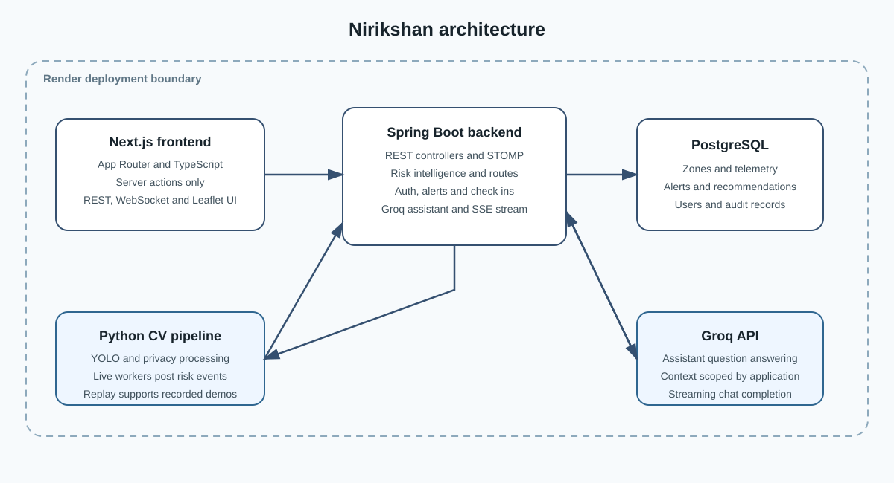
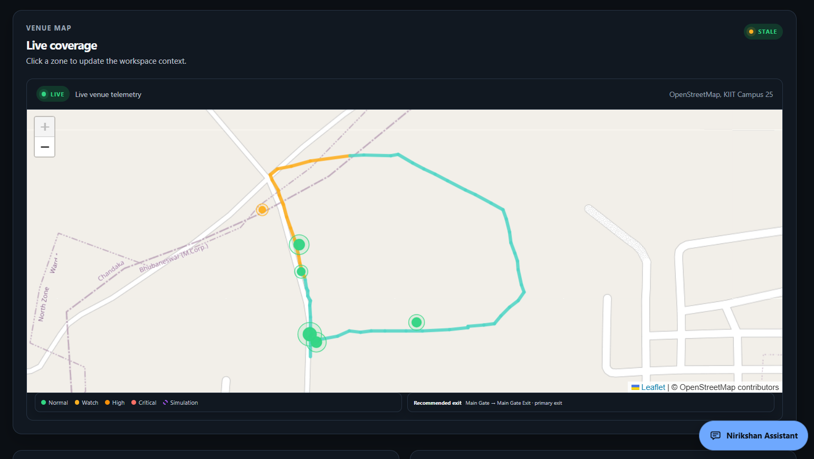
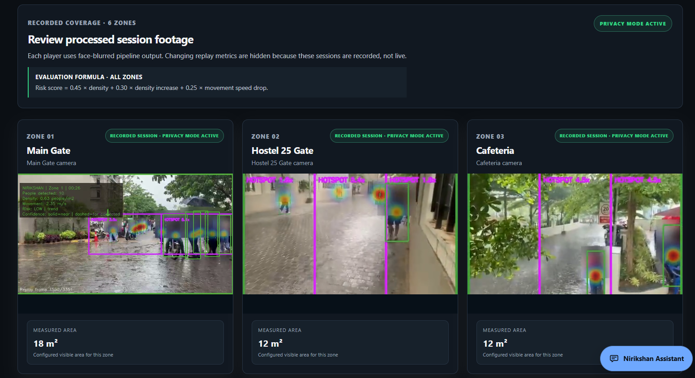
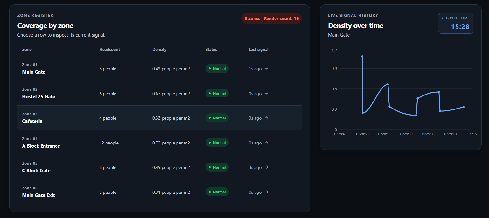
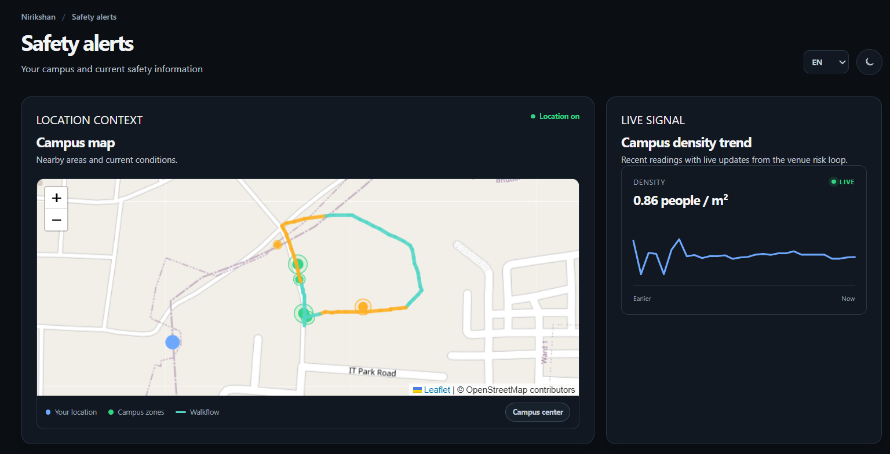

# Nirikshan

Nirikshan is a campus crowd safety platform that processes camera telemetry, evaluates zone risk, and delivers live operational and citizen safety information.

## 1. Problem statement

Campus safety teams need a current view of crowd density, headcount, changing risk, active alerts, and evacuation options across several zones. Nirikshan combines computer vision telemetry, backend risk evaluation, live dashboard updates, route guidance, security check ins, and a citizen safety view.

## 2. Key features

### Live features

1. The Python computer vision pipeline processes camera input with Ultralytics YOLO and posts aggregate zone telemetry to the Spring Boot backend.
2. The live dashboard displays zone headcount, perspective weighted density, recent signals, status, venue coverage, and recommended exits.
3. Risk scoring combines density, density increase, and movement speed drop using configurable thresholds and weights.
4. Live risk updates, alerts, recommendations, and forecasts are distributed through WebSocket topics.
5. Evacuation logic uses the configured venue route graph, current conditions, blocked route information, and route recommendations.
6. The security check in system lets administrators start a staff check in and lets security staff confirm their status. Check in updates are published to connected clients.
7. The Groq powered AI assistant answers supported campus safety questions using the current zone, alert, incident, route, and recommendation context assembled by AssistantService.

### Demo and recorded features

1. The Demo Feeds tab shows pre processed, privacy blurred footage for six zones.
2. Demo Feeds is a recorded replay experience. It is not live camera coverage.
3. Recorded session events are loaded from local replay output or backend job files, depending on the configured environment.

## 3. Architecture overview

### Frontend

The frontend is a Next.js App Router application. It uses server actions for server side data loading and has no Next.js API routes. Browser clients call the Spring Boot backend and subscribe to STOMP topics over WebSocket. Leaflet and OpenStreetMap provide the map views.

### Backend

The backend is a Spring Boot application using PostgreSQL through Spring Data JPA. It provides REST endpoints for zones, telemetry, alerts, incidents, routes, forecasts, announcements, assistant requests, and security check ins. WebSocket messaging distributes live operational updates.

### Computer vision pipeline

The CV pipeline is Python based and uses OpenCV, PyTorch, Ultralytics YOLO, NumPy, Requests, and Matplotlib. The live worker defaults to yolo26s.pt and uses overlapping tiled inference. Detections are privacy processed, mapped to configured zones, and converted into headcount, perspective weighted density, movement, hotspot, and risk event data.

### AI assistant

The AI assistant is implemented in the backend through AssistantService and GroqChatClient. AssistantService scopes requests to the selected venue and caller role, gathers the operational safety context, constructs the configured prompt, and sends it to Groq. The current default model in code is openai/gpt-oss-20b. The model is configurable through nirikshan.incident-summary.model. The assistant is intended for campus safety questions grounded in available operational data.

### Deployment

Render configuration is provided for the Spring Boot backend. The backend connects to PostgreSQL, exposes the health endpoint /api/health, and serves REST and WebSocket data. The frontend is configured separately with the backend API and WebSocket URLs. The deployment configuration does not run the Python computer vision workers.

For the detailed runtime data flow and module references, see [docs/ARCHITECTURE.md](docs/ARCHITECTURE.md).

## 4. Tech stack

### Frontend

| Area | Verified technology |
| --- | --- |
| Application | Next.js 14.2.15, React 18.3.1, TypeScript 5.6.3 |
| Maps | React Leaflet 4.2.1, Leaflet 1.9.4, Leaflet Heat 0.2.0 |
| Charts | Recharts 2.13.3 |
| Live messaging | STOMP.js 7.0.0, SockJS Client 1.6.1 |
| Styling and build | Tailwind CSS 3.4.14, PostCSS 8.4.49, Autoprefixer 10.4.20 |
| Progressive web app | Next PWA 5.6.0 |

### Backend

| Area | Verified technology |
| --- | --- |
| Runtime | Java 17 |
| Framework | Spring Boot 3.3.5 |
| Web and data | Spring Web, Spring Data JPA, Spring WebSocket, Spring Validation |
| Security | Spring Security, JJWT 0.12.6 |
| Database | PostgreSQL JDBC driver, Flyway, Flyway PostgreSQL support |
| Development and testing | H2, Spring Boot Starter Test, Lombok |
| API documentation | Springdoc OpenAPI WebMVC UI 2.6.0 |

### Computer vision

| Area | Verified technology |
| --- | --- |
| Language | Python |
| Vision and inference | OpenCV, PyTorch, Ultralytics |
| Numerical and utility libraries | NumPy, Requests, Matplotlib |
| Default model | yolo26s.pt |

## 5. Setup and local run

### Requirements

1. Node.js and npm for the frontend.
2. Java 17 and Maven for the backend.
3. PostgreSQL for persistent local backend data.
4. Python 3.10 or a compatible Python version for the CV pipeline.
5. A Groq API key for AI assistant requests.

### Backend

From the repository root, configure the database, JWT, allowed origin, and Groq environment values required by the active Spring profile. Then run:

~~~
mvn spring-boot:run
~~~

The backend health endpoint is available at http://localhost:8080/api/health. On Windows, run-backend.ps1 provides a local launcher with a Maven fallback.

For the disposable H2 development profile:

~~~
$env:SPRING_PROFILES_ACTIVE="dev"
mvn spring-boot:run
~~~

For PostgreSQL, set SPRING_PROFILES_ACTIVE, DATABASE_URL, DATABASE_USERNAME, and DATABASE_PASSWORD before starting the backend. The project also supports the database environment variables documented in the backend configuration.

### Frontend

From the frontend directory:

~~~
npm install
copy .env.local.example .env.local
npm run dev
~~~

Set NEXT_PUBLIC_API_BASE_URL to the backend URL and NEXT_PUBLIC_WS_URL to the backend WebSocket URL in .env.local. The frontend scripts are also available as npm run build, npm run start, and npm run lint.

See [frontend/README.md](frontend/README.md) for frontend specific configuration and behavior.

### Computer vision pipeline

From the cv-pipeline directory:

~~~
python -m venv .venv
.\\.venv\\Scripts\\Activate.ps1
pip install -r requirements.txt
~~~

Configure the model weights, zone inputs, calibration values, and backend event URL required by the selected worker. Use run_local_cv_workers.py for the shared live worker flow or process_video.py for a configured video source.

See [cv-pipeline/README.md](cv-pipeline/README.md) for the complete CV setup, CUDA options, calibration instructions, privacy processing, and replay commands.

## 6. Project structure

1. frontend contains the Next.js application, server actions, pages, dashboard views, map components, assistant widget, and recorded session interface.
2. src/main/java contains the Spring Boot application, REST controllers, services, repositories, persistence entities, security, WebSocket configuration, route logic, and Groq client.
3. src/main/resources contains Spring configuration and database migrations.
4. cv-pipeline contains the Python inference workers, tiled detection, privacy processing, calibration, risk scoring, and replay utilities.
5. docs contains the architecture guide and README images.
6. render.yaml defines the Render backend service configuration.
7. Dockerfile builds and runs the Spring Boot backend and packages recorded session outputs.

## 7. Screenshots

### Dashboard overview

This view shows the live venue map, current telemetry state, zone markers, risk legend, and recommended exit information.

### Recorded video sessions

This view shows the Demo Feeds tab with privacy mode enabled and pre processed footage for recorded zone sessions.

### Zone table and live signal history

This view shows zone headcount, density, status, signal freshness, and the selected zone density history.

### Citizen safety view

This view shows the citizen facing safety alerts page with campus map context and a live density trend.

The repository currently contains these four supplied screenshots. No separate security check in panel image is present in docs/images, so no guessed or placeholder image reference is included.

## 8. Known limitations

1. Detection accuracy varies with lighting, camera angle, weather, crowd overlap, and occlusion.
2. Density quality depends on zone geometry, measured area, perspective calibration, and camera input quality.
3. Demo Feeds uses pre processed recorded footage and must not be interpreted as live camera coverage.
4. Route recommendations depend on the configured venue route graph and the telemetry and alert data available to the backend.
5. The AI assistant is limited to the operational campus safety context assembled by AssistantService.
6. The deployed Render backend does not run the local Python inference workers.
